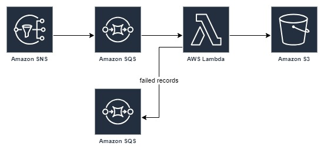

# SNS to S3 Pipeline
`Developer`: Divyansh Patel
This project sets up a serverless architecture to process messages from an SNS topic, store them in an S3 bucket, and handle failed records using an SQS Dead Letter Queue (DLQ). The architecture uses AWS services including SNS, SQS, Lambda, and S3.

## Architecture

1. **Amazon SNS**: The starting point of the pipeline where messages are published.
2. **Amazon SQS**: Subscribed to the SNS topic to receive messages.
3. **AWS Lambda**: Processes the messages from SQS and uploads them to an S3 bucket.
4. **Amazon S3**: Stores the processed messages.
5. **Dead Letter Queue (DLQ)**: Captures messages that failed processing.

## Serverless Framework Configuration

The `serverless.yml` file is used to define the infrastructure as code using the Serverless Framework.

### Key Components

- **SNS Topic**: Created if not using an existing one.
- **SQS Queue**: Subscribed to the SNS topic.
- **Lambda Function**: Processes messages from the SQS queue and uploads to S3.
  
## Environment Variables
Ensure the following environment variables are set in your deployment environment:
`DI_AWS_ACCESS_KEY`
`DI_AWS_SECRET_KEY`
`DI_AWS_REGION_NAME`
`DATA_BUCKET_NAME`
`DEBUG (optional)`
### Notes
Replace placeholders in the serverless.yml and Lambda function with actual values.
Ensure secure management of AWS credentials and other sensitive information.
Review and adjust IAM roles and permissions as necessary.
